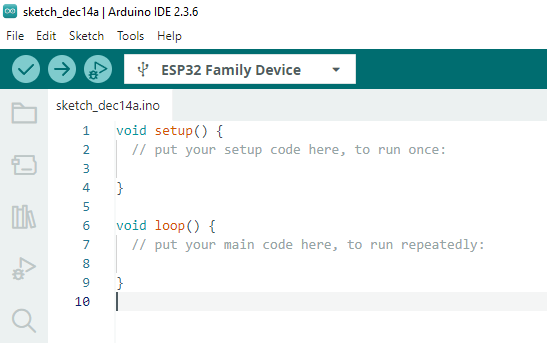
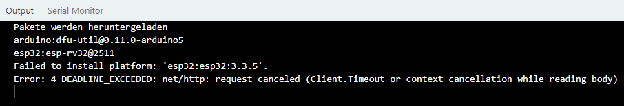
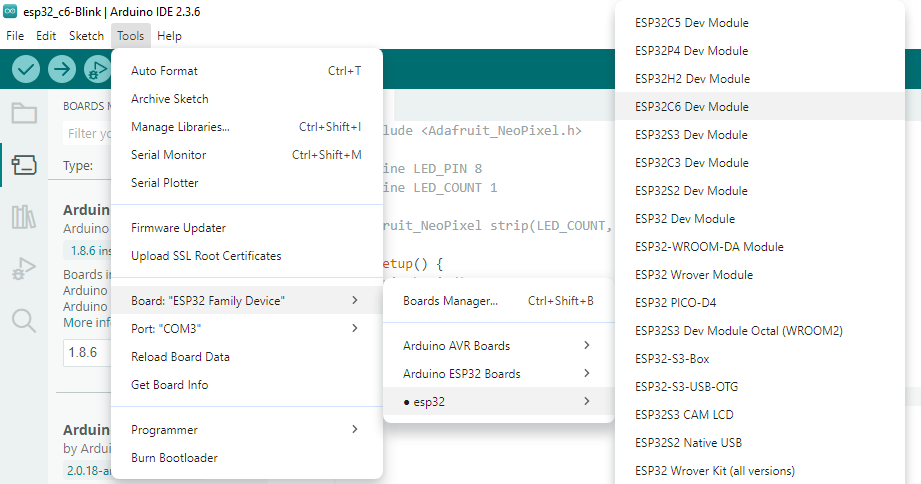
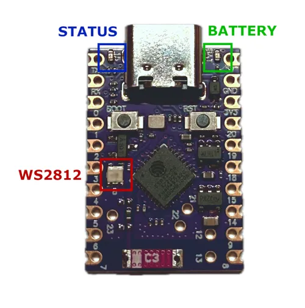
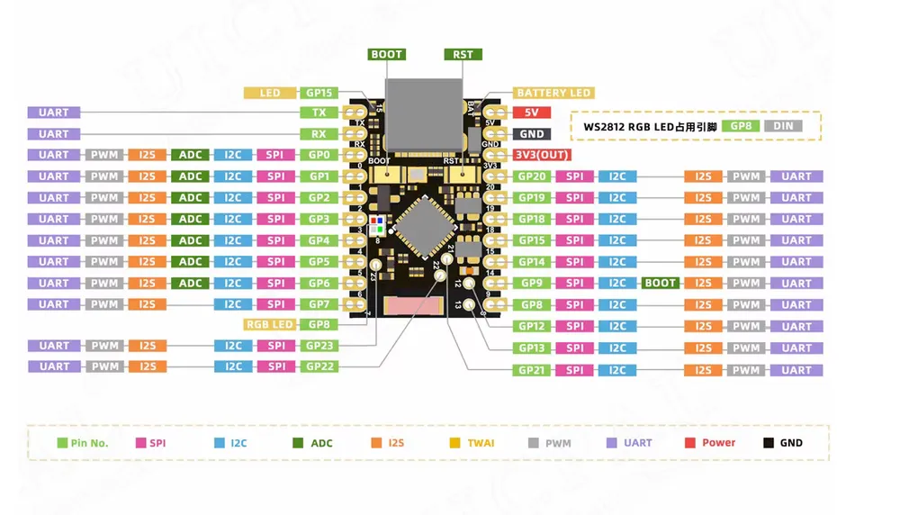

# Coding with Adruino

## 0. Setup

Starting a new `sketch` will result in the following code:

<div style="text-align:center;">
    
</div>

Pressing the `check` icon will result in doing a `Verify` of the code. This will lead to an error without changing anything:

<div style="text-align:center;">
    
</div>

To remove this error, it's necessary to chose a defined micro controller. In this case, the `esp32` board managing is needed:

<div style="text-align:center;">
    
</div>

The second option by `Espressif Systems` got selected and installed. For some reason, the `Client.Timeout` value is by standard to low so that the installation runs into the `DEADLINE_EXCEEDED` error.

<div style="text-align:center;">
    
</div>

A fix for this problem can be found here: [forum.arduino](https://forum.arduino.cc/t/downloading-esp32-3-3-5-fails/1420739). The following steps are required:

1. Close Arduino IDE by pressing File > Quit.
2. Open the file explorer under the following direction: `C:\Users\<username>\.arduinoIDE\arduino-cli.yaml`
3. Open the file with a text editor and add:

```
network:
    connection_timeout: 300s
```
4. Save the file and start Arduino IDE.

Now under the header `Tools` the correct `esp32` device can be choosen like this:

> Tools -> Board: "ESP32 Family Device" -> esp32 -> ESP32C6 Dev Module

<div style="text-align:center;">
    
</div>

Now code can be written and if the sketch is compilable, it can be `uploaded` to the board by pressing on the arrow.

## 1. Layout of the ESP32-C6 Super Mini

The physical layout of the micro controller can be seen in the following image:

<div style="text-align:center;">
    
</div>

- The `Battery LED` always blinks while being pluged in
- The `Status LED` turns on, if `BOOT` mode is enabled
    - The boot mode can be accesed by pressing and holding the left button `BOOT` and pressing the `RST`-button afterwards. Leave the boot mode by pressing `RST` once.
- The `WS2812 LED` can be programmed by using the `#include <Adafruit_NeoPixel.h>` library

An actual layout of every pin is given in the following image:

<div style="text-align:center;">
    
</div>

## 2. Getting Started - Blink Module

Creating a new Sketch will automatically generate two functions:

``` C++
void setup() {
  // put your setup code here, to run once:
}

void loop() {
  // put your main code here, to run repeatedly:
}
```

The `setup` is used to initialize `PINs` and other components. In 